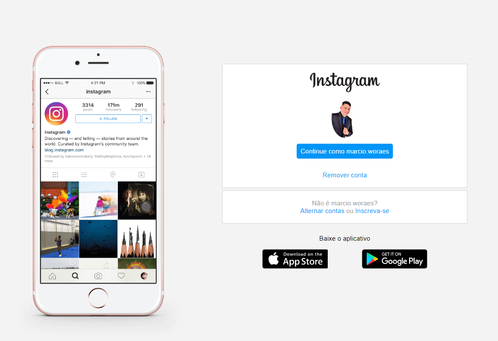

```
# instagram-login-page
```

Curso do Bootcamp Spread Fullstack Developer [Digital Innovation One][DigitalInnovationOne]


Neste projeto recriamos a página de login do Instagram, apliquei os conhecimentos adquiridos  de HTML, CSS com Flexbox, uma das abordagens de posicionamento de elementos mais utilizadas quando se trata de responsividade.


____

- <a href="https://instagram-login-page-ten.vercel.app/">Projeto Desenvolvido:</a>




## Tecnologias utilizadas

- [HTML](https://www.w3schools.com/html/)
- [CSS](https://developer.mozilla.org/pt-BR/docs/Web/CSS)

#### Orientado pela expert:

Gabriela Spruce


______

